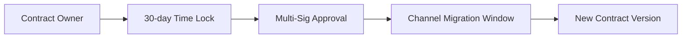

# BitLight-Chain: Stacks-Bitcoin Atomic Payment Channels Protocol

## Architecture Overview

### Cross-Chain Payment Channels

Implements Bitcoin-compatible payment channels with Stacks L2 enforcement:

```
Bitcoin Network (Settlement Layer) ↔ BitLight-Chain (Stacks L2) ↔ Stacks Mainnet
```

### Core Components

1. **Channel Factories** - BIP32-derived channel ID generation
2. **Atomic Balance Management** - Dual-balance system with Bitcoin-style UTXO locking
3. **Dispute Engine** - 144-block challenge period (≈24h) with penalty proofs
4. **Interoperability Layer** - LN-compatible message formats with secp256k1 ECDSA

## Key Features

### Bitcoin-STX Atomic Swaps

- **BIP32 Channel IDs**: 256-bit channel identifiers compatible with Bitcoin HD wallets
- **UTXO-Style Escrow**: STX locked using Bitcoin script-inspired constraints
- **Cross-Chain Proofs**: SPV-like verification for Bitcoin transaction finality

### Enterprise-Grade Security

- **Multi-Signature Enforcement**: 2-of-2 participant authorization requirements
- **Revocable Commitments**: Penalty system for stale state submissions
- **Time-Locked Withdrawals**: 144-block dispute period (configurable)

### Lightning Network Compatibility

| Feature          | BitLight Implementation       |
| ---------------- | ----------------------------- |
| Payment Channels | STX/BTC atomic swap enabled   |
| HTLCs            | Native Stacks smart contracts |
| Network Topology | Bitcoin-compatible node IDs   |
| Routing          | On-chain dispute resolution   |

## Development Setup

### Requirements

- Clarinet v1.5.0+
- Bitcoin Core v24+ (regtest mode)
- Stacks Node v2.05+

### Installation

```bash
git clone https://github.com/yourorg/bitlight-chain.git
cd bitlight-chain/clarinet
```

## Contract Functions

### Channel Management

```clarity
;; Create payment channel with Bitcoin-compatible parameters
(create-channel (channel-id 0x...) (participant-b 'STX-address) (deposit 100000))

;; Fund existing channel with additional STX
(fund-channel 0x... 'STX-address 50000)
```

### Dispute Resolution

```clarity
;; Initiate unilateral close with penalty proof
(initiate-unilateral-close 0x... 'STX-address 75000 25000 0xSig)

;; Finalize channel after dispute period
(resolve-unilateral-close 0x... 'STX-address)
```

## Governance Features

### Upgrade Mechanism


